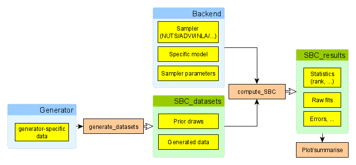

## What is SBC?

SBC stands for "simulation-based calibration" and it is a tool
to validate statistical models and/or algorithms fitting those models. 
In SBC we are given a statistical model, 
a method to generate draws from the prior predictive distribution 
(i.e. generate simulated datasets that match the model's priors + likelihood) 
and an algorithm that fits the model to data.

The rough sketch of SBC is that we simulate some datasets and then for each simulated dataset:

1. Fit the model and obtain $D$ independent draws from the posterior.
2. For each variable of interest, take the rank of the simulated value within the
   posterior draws
   - Where rank is defined as the number of draws < simulated value

It can be shown that if model matched the generator and algorithm works correctly,
then for each variable, the ranks obtained in SBC should be uniformly distributed between $0$ and $S$.
This corresponds quite directly to claims like 
"the posterior 84% credible interval should contain the simulated value in 84% of simulations",
the rank uniformity represents this claim for all interval widths at once. The theory of SBC is fully
described in [Talts et al.](https://arxiv.org/abs/1804.06788)

This opens two principal use-cases of SBC:

a) We have an algorithm that we trust is correct and a generator and and we want to check 
  that we correctly implemented our Bayesian model
b) We have a generator and a model we trust and we want to check
  whether a given algorithm correctly computes the posterior.

In any case, a failure of SBC only tells us that at least one of the three 
pillars of our inference (generator/model/algorithm) is mismatched to others.

In the context of larger Bayesian workflow 
(as discussed e.g. in [Bayesian Workflow](https://arxiv.org/abs/2011.01808) by Gelman et al. 
or [Towards A Principled Bayesian Workflow](https://betanalpha.github.io/assets/case_studies/principled_bayesian_workflow.html) by Betancourt), SBC can be used to validate the implementation of a model/algorithm,
which is just one of many things to check if one needs a robust analysis.
In particular, SBC does not use any real data and thus cannot tell you anything
about potential mismatch between your model and the actual data you plan to analyze.
However, this is in some sense an advantage: if our model fails (e.g. we have convergence
problems) on real data, we don't know whether the problem is a bug in our model
or a mismatch between the model and the data. 
If we simulate data exactly as the model assumes, any problem has to be a bug.
Additionally, we can use SBC to better understand whether the data we plan
to collect are actually capable of answering the questions we have.

This vignette will demonstrate how the basic package interface can be used to 
run simulations, calculate ranks and investigate calibration.

## Aims of the package

The SBC package aims to provide a richer and more usable alternative to `rstan::sbc()`.
The main design goals is to make it easy to incorporate SBC in your everyday modelling
workflow. To this end:

- No changes to your model are needed to test it with SBC.
- Once you have your model and code to simulate data ready, it is easy to gradually move from 1 simulation to check
  your model does not crash to 1000 simulations that can resolve even small inaccuracies.

We intentionally do not focus on mechanisms that would let you automatically 
construct a simulator just from your model: if we did that, any bugs in your
model would automatically carry over to the simulator and the SBC would only
check that the algorithm works. Instead we believe it is good practice to
implement the simulator in the most easy way possible while altering aspects
of the implementation that should not matter (e.g. for loops vs. matrix multiplication).
The best solution would be to have one person write the simulator and a different
person the model (though that would often be impractical).
This way you get two independent pieces of code that should correspond to the same data
generating process and it becomes less likely that there is the same mistake in both 
versions. A mistake that is in just one version can then be (at least in principle) 
caught by SBC. 

This is actually a well known pattern in software safety: 
 critical components in airplanes are required to have two completely 
 independent implementations of the same software 
(or even hardware) and the system checks that both produce the same output for the same input.
Similarly, pharmaceutical
companies analyzing drug trials are  required to have the data analysis 
pipeline written by two separate teams and the results of both must match 
(this is not required for academic trials - who would need
safety there, right?). The main reason this method is used relatively rarely is that
implementing the same thing twice is costly. But statistical models are usually relatively small
pieces of code and the added cost of the second implementation (the generator)
thus tends to very small. 

## Naming

To avoid confusion the package and the docs tries to consistently give the same meaning to the following potentially ambiguous words:

- _variable_ All quantities of interest for SBC - this includes both parameters that are directly estimated by the model and quantities derived from those parameters.
- _draws_ are assumed to come from either a single realized  posterior distribution of a fitted model or the prior distribution of the model. The number of draws ( `n_draws`) is the number of posterior draws produced by fitting the model.
- _simulation_ / _sim_ a set of simulated values for all variables and the accompanying generated data. I.e. the number of simulations (`n_sims`) is the number of times an individual model is fitted
- _fit_ represents the result of fitting a single simulation


## Overview of the Architecture




To perform SBC, one needs to first generate simulated datasets and then fit the
model to those simulations. The `SBC_datasets` object holds the simulated prior and data draws. 
`SBC_datasets` objects can be created directly by the user, but it is often easier to use one
of provided _Generator_ implementations that let you e.g. wrap a function  that returns the variables and observed data for a single simulation or use a `brms` specification to generate
draws corresponding to a given `brms` model. 

The other big part of the process is a  _backend_.
The SBC package uses a backend object to actually fit the model to the simulated data and generate posterior draws. In short, backend bundles together the algorithm in which inference is run (`cmdstanr`, `rstan`, `brms`, `jags`, etc.), the model, and additional platform-specific inference parameters which are necessary to run inference for the model-platform combination (e.g. number of iterations, initial values, ...). 
In other words backend is a function that takes data as its only input and provides posterior draws.

Once we have a backend and an `SBC_datasets` instance, we can call `compute_SBC` 
to actually perform the SBC. The resulting object can then be passed to various plotting 
and summarising functions to let us easily learn if our model works as expected. 

## Simple Poisson Regression

In this vignette we will demonstrate how the interface is used with a simple poisson model. First we'll
setup and configure our environment.

```{r setup, message=FALSE,warning=FALSE, results="hide"}
library(SBC);

use_cmdstanr <- getOption("SBC.vignettes_cmdstanr", TRUE) # Set to false to use rstan instead

if(use_cmdstanr) {
  library(cmdstanr)
} else {
  library(rstan)
  rstan_options(auto_write = TRUE)
}

options(mc.cores = parallel::detectCores())

# Enabling parallel processing via future
library(future)
plan(multisession)

# The fits are very fast,
# so we force a minimum chunk size to reduce overhead of
# paralellization and decrease computation time.
options(SBC.min_chunk_size = 5)

# Setup caching of results
if(use_cmdstanr) {
  cache_dir <- "./_basic_usage_SBC_cache"
} else {
  cache_dir <- "./_basic_usage_rstan_SBC_cache"
}
if(!dir.exists(cache_dir)) {
  dir.create(cache_dir)
}

```

### Model Setup

We will be running SBC against a model that defines `y ~ Poisson(lambda)`, where `lambda ~ Gamma(15, 5)`. We will use the following Stan model:

```{r, comment = ""}
cat(readLines("stan/poisson.stan"), sep = "\n")
```

```{r, include = TRUE}
if(use_cmdstanr) {
  cmdstan_model <- cmdstanr::cmdstan_model("stan/poisson.stan")
} else {
  rstan_model <- rstan::stan_model("stan/poisson.stan")
}

```

### Generator

Once we have defined the model, we can create a generator function which will generate prior and data draws:

```{r}
# A generator function should return a named list containing elements "variables" and "generated"

poisson_generator_single <- function(N){  # N is the number of data points we are generating
  lambda <- rgamma(n = 1, shape = 15, rate = 5)
  y <- rpois(n = N, lambda = lambda)
  list(
    variables = list(
      lambda = lambda
    ),
    generated = list(
      N = N,
      y = y
    )
  )
}
```

As you can see, the generator returns a named list containing random draws from the prior and generated data realized from the prior draws - the data are already in the format expected by Stan.

### Create `SBC_datasets` from generator

`SBC` provides helper functions `SBC_generator_function` and `generate_datasets` which takes a generator function and calls it repeatedly to create a valid `SBC_datasets` object. 

```{r}
set.seed(54882235)
n_sims <- 100  # Number of SBC iterations to run

poisson_generator <- SBC_generator_function(poisson_generator_single, N = 40)
poisson_dataset <- generate_datasets(
  poisson_generator, 
  n_sims)
```


### Defining backend

Once we have the model compiled we'll create a backend object from the model. `SBC` includes pre-defined backend objects for HMC sampling with `cmdstan` and `rstan`. In addition, it also provides generator function and backend for `brms` based models. 

Note that you can create your own backend if you wish to use a different sampling/optimization platform, such as variational inference or JAGS. 

Here we'll just use the pre-defined cmdstan backend, in which we pass our compiled model and any additional arguments we would like to pass over to the sampling method:

```{r}
if(use_cmdstanr) {
  poisson_backend <- SBC_backend_cmdstan_sample(
    cmdstan_model, iter_warmup = 1000, iter_sampling = 1000, chains = 2)
} else {
  poisson_backend <- SBC_backend_rstan_sample(
    rstan_model, iter = 2000, warmup = 1000, chains = 2)  
}
```

### Computing Ranks

we can then use `compute_SBC` to fit our simulations with the backend:

```{r, results=FALSE}
results <- compute_SBC(poisson_dataset, poisson_backend, 
                    cache_mode = "results", 
                    cache_location = file.path(cache_dir, "results"))
```

Here we also use the caching feature to avoid recomputing the fits when recompiling this vignette. 
In practice, caching is not necessary but is often useful.

### Viewing Results

We can now inspect the results to see if there were any errors and check individual stats:

```{r}
results$stats
```

### Plots

And finally, we can plot the rank distribution to check if the ranks are uniformly distributed. We can check the rank histogram and ECDF plots (see `vignette("rank_visualizations")` for description of the plots):

```{r rank_hist}
plot_rank_hist(results)
```

```{r ecdf}
plot_ecdf(results)
```

```{r ecdf_diff}
plot_ecdf_diff(results)
```

Since our simulator and model do match and Stan works well, we see that the plots don't show any violation.


## Is SBC frequentist?

A bit of philosophy at the end - SBC is designed to test Bayesian models and/or algorithms,
but it fits very well with standard frequentist ideas (and there is no shame about this).
In fact, SBC can be understood as a very pure form of hypothesis testing as the
"null hypothesis" that the ranks are uniformly distributed is completely well specified,
can (beyond numerical error) actually hold exactly and we are conducting
the test against a hypothesis of interest. SBC thus lets us follow a 
simple naive-Popperian way of thinking: we try hard to disprove a hypothesis 
(that our model + algorithm + generator is correct) and when we fail to disprove
it, we can consider the hypothesis corroborated to the extent our test was severe.
This is unlike many scientific applications of hypothesis testing where 
people use a rejection of the null hypothesis
 as evidence for alternative (which is usually not warranted).
 
We currently can't provide a good theoretical understanding of the severity
of a given SBC test, but obviously the more iterations and the narrower the confidence
bands of the `ecdf` and `ecdf_diff` plots, the more severe the test.
One can also use `empirical_coverage()` and `plot_coverage()` functions to investigate
the extent of miscalibration that we cannot rule out given our results so far.

Alternatively, one can somewhat sidestep the discussions about
philosophy of statistics and understand SBC as a probabilistic unit test for your model.
In this view, SBC tests a certain identity that we expect to hold if our
system is implemented correctly, similarly
how one could test an implementation of an arithmetical system by 
comparing the results of computing $(x + y)^2$ and $x^2 + 2xy + y^2$ -
any mismatch means the test failed.


## Where to go next?

You may want to explore short examples showing how SBC can be used to diagnose
[bad parametrization](https://hyunjimoon.github.io/SBC/articles/bad_parametrization.html)
or [indexing bugs](https://hyunjimoon.github.io/SBC/articles/indexing.html) or
you may want to read through a longer example of what we consider best
practice in [model-building workflow](https://hyunjimoon.github.io/SBC/articles/small_model_workflow.html).

Alternatively, you might be interested in the [limits of SBC](https://hyunjimoon.github.io/SBC/articles/limits_of_SBC.html) 
--- the types of problems that are hard / impossible to catch with SBC and
what can we do to guard against those.
