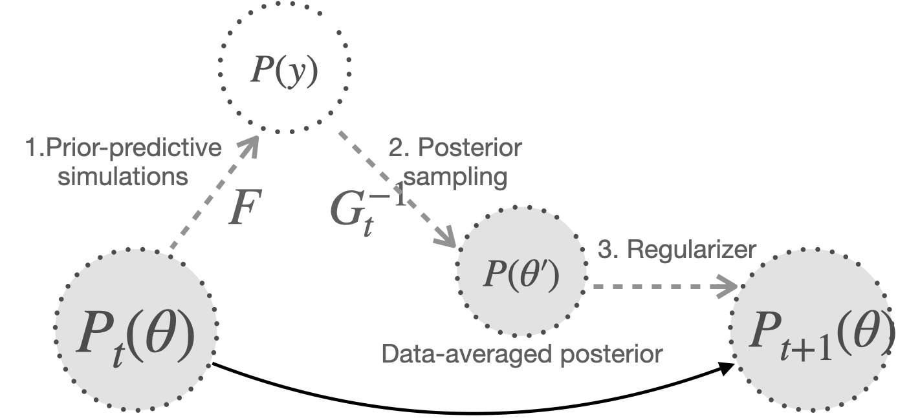

```{r setup, include=FALSE, warning=FALSE}
library(SBC)
library(cmdstanr)
library(parallel)
library(bayesplot)
library(posterior)
library(dplyr)
library(rstan)
library(future)
library(ggpubr)
library(mclust)
library(rstanarm)
library(ggplot2)
options(mc.cores = parallel::detectCores())
plan(multisession)
options(SBC.min_chunk_size = 5)
set.seed(1984)
```


Definition:

- simulation prior := prior distribution that informs the prior predictive simulations and is being iteratively updated

- inference prior := prior distribution that informs the posterior distribution, and hence the posterior sampling method

- prior predictive distribution $P(y)$:= marginal distribution of $y, p(y)$ 

- data-averaged posterior $P(\theta')$:= combined posterior samples from each datasets

- posterior sampling method := a.k.a. inference algorithm in which distribution is the function of prior predictive distribution and inference prior

- default prior of chosen likelihood and posterior sampling method := wide enough prior to the level of not hurting self-consistency

Prior predictive distribution is determined by two components, prior distribution and likelihood.
$$p(y_1,..,y_n) = \int \prod_{i=1}^{n} f(y_i|\theta)p(\theta)d\theta$$

Let us denote the distribution of likelihood and posterior sampling method as $F, G^{-1}$. Inverse is used to denote most poterior sampling methods reversely uses likelihood distribution to minimize the distance between the target and generated distribution. In SBC package, `glm` formula used for predictive distribution can be used as a approximation, what we call backend. See [implementing_backends](https://hyunjimoon.github.io/SBC/articles/implementing_backends.htmls) vignette for this.



Proposition: Iteration of prior predictive simulation, posterior sampling, and regularizing converge to a default prior for a given prior distribution family, likelihood, and inference algorithm.

This is due to the recurrence of well-calibrated regions which will be illustrated in experiment 1 which shows different priors converging to the same distribution for simple Bernoulli likelihood and Laplace approximation as a inference algorithm. This approximation truncates Taylor expansion of the log target density at the mode to the sencond order i.e. $\mu_{t+1} = argmax \;f(w)$, $\sigma_{t+1} = -\frac{d^{2}}{d w^{2}} \log f(w) ; w=w_{0}$.


# Experient 1. 1.Normal simulation prior (samples: 100), 2.Bernouli-logit prior predictive simultation, 3. Laplace approximation posterior sampling (draws: 100), 4. Plugging mean and sd of the data-averaged posterior to the next simulation prior as the regularizer

Target parameter is logit-transformed probability, $a$. Binomial likelihood and laplace approximation inference algorithm on logit scale is used. Hyperparameters for laplace approximation are $\mu, \sigma$ which correspond to posterior distribution mode and second derivative at the mode. These hyperparameter values are set as the prior parameter for the iteration. Results show starting from $N(0, 3^2)$ distribution, initial non-normal distribution slowly transforms to normal form to adjust to the constraints imposed by the approximation of inference algorithm, in this case normal distribution. Final convergence is around $N(0, 0.5^2)$.

```{r, warning=FALSE, error=FALSE}
model = stan_model("./models/binom-laplace.stan")
SBC_iter <- 1000
# prior hyperparameters
mu <- 0
sigma <- 3
mu_lst <- c()
sigma_lst <- c()
# experiment settings
## the number of dataset
nsims <- 100
## outcome dimension for each dataset
nobs <- 2
## posterior samples for each dataset
ndraws <- 100
## number of binomial trials
nsize <- 1
for (j in 1:SBC_iter){
  post_draws_theta <- c()
  theta <- rnorm(nsims, mu, sigma)
  for (i in 1:nsims) {
  	p <- invlogit(theta[i])
  	y <- rbinom(nobs, nsize, p)
  	dat <- list(Y=as.array(y), nsize=nsize, nobs=nobs, mu = mu, sigma = sigma)
  	fit <- optimizing(model, data = dat, hessian = TRUE)
  	
  	# approximate posterior mean via posterior mode
  	post_mean_theta <- fit$par["theta"]
  	
  	# approximate posterior sd via (sqrt) of the inverse negative Hessian
  	post_sd_theta <- sqrt(solve(-fit$hessian))
  	post_draws_theta <- c(post_draws_theta, rnorm(ndraws, post_mean_theta, post_sd_theta))
  }

  # regularizer: update hyperparameters
  mu_est <- mean(post_draws_theta)
  mu <- mu_est
  sigma_est <- sd(post_draws_theta)
  sigma <- sigma_est
    
  if ((j-1) %% 30 ==0){
    hist(invlogit(post_draws_theta), xlim = range(0,1), main = paste(j, "th itheration histogram"))  
  }
  mu_lst <- c(mu_lst, mu)
  sigma_lst <- c(sigma_lst, sigma)
}
plot(unlist(mu_lst), ylab = "prior mean")
plot(unlist(sigma_lst), ylab = "prior sd")
print(sigma_lst[length(sigma_lst)])
```

Would this converging distribution be unique? From the result below, starting from $N(3, 1^2)$ which is unsymmetrical compared to $N(0, 3^2)$, also converges to a similar distribution. A likeable explanation is the recurrence of parameter values within well-calibrated region as opposed to that are not. For instance, if $logit^{-1}(\theta)$ starts from 0.9, is likely to form a non-normal posterior whose mode is more likely to move away from 0.9. On the other hand, parameter values near .5 forms a symmetric and stable posterior which in most cases has its mode near .5. In this case, the disstribution converge to around $N(0, 0.4^2)$

```{r, warning=FALSE, error=FALSE}
model = stan_model("./models/binom-laplace.stan")
SBC_iter <- 1000
# prior hyperparameters
mu <- 3
sigma <- 1
mu_lst <- c()
sigma_lst <- c()
# experiment settings
## the number of dataset
nsims <- 100
## outcome dimension for each dataset
nobs <- 2
## posterior samples for each dataset
ndraws <- 100
## number of binomial trials
nsize <- 1
for (j in 1:SBC_iter){
  post_draws_theta <- c()
  theta <- rnorm(nsims, mu, sigma)
  for (i in 1:nsims) {
  	p <- invlogit(theta[i])
  	y <- rbinom(nobs, nsize, p)
  	dat <- list(Y=as.array(y), nsize=nsize, nobs=nobs, mu = mu, sigma = sigma)
  	fit <- optimizing(model, data = dat, hessian = TRUE)
  	
  	# approximate posterior mean via posterior mode
  	post_mean_theta <- fit$par["theta"]
  	
  	# approximate posterior sd via (sqrt) of the inverse negative Hessian
  	post_sd_theta <- sqrt(solve(-fit$hessian))
  	post_draws_theta <- c(post_draws_theta, rnorm(ndraws, post_mean_theta, post_sd_theta))
  }
  if ((j-1) %% 300 == 0){
    hist(invlogit(post_draws_theta), xlim = range(0,1), main = paste(j, "th itheration histogram"))  
  }
  
  # regularizer: update hyperparameters
  mu_est <- mean(post_draws_theta)
  mu <- mu_est
  sigma_est <- sd(post_draws_theta)
  sigma <- sigma_est
    
  if ((j-1) %% 30 ==0){
    hist(invlogit(post_draws_theta), xlim = range(0,1), main = paste(j, "th itheration histogram"))  
  }
  mu_lst <- c(mu_lst, mu)
  sigma_lst <- c(sigma_lst, sigma)
}
plot(unlist(mu_lst), ylab = "prior mean")
plot(unlist(sigma_lst), ylab = "prior sd")
print(sigma_lst[length(sigma_lst)])
```

# Experiment 2. Change experimental settings
## 2-1. Decreasing the number of prior samples from 100 to 10

Drastic jumps are observed. This may be due to simultation noise but observed oscillation of after the jump tells zero calibration bias prior is the form of a point, not a range. 

```{r, warning=FALSE, error=FALSE}
model = stan_model("./models/binom-laplace.stan")
SBC_iter <- 10000
# prior hyperparameters
mu <- 1
sigma <- 10
mu_lst <- c()
sigma_lst <- c()
# experiment settings
## the number of dataset
nsims <- 100
## outcome dimension for each dataset
nobs <- 2
## posterior samples for each dataset
ndraws <- 100
## number of binomial trials
nsize <- 1
for (j in 1:SBC_iter){
  post_draws_theta <- c()
  theta <- rnorm(nsims, mu, sigma)
  for (i in 1:nsims) {
  	p <- invlogit(theta[i])
  	y <- rbinom(nobs, nsize, p)
  	dat <- list(Y=as.array(y), nsize=nsize, nobs=nobs, mu = mu, sigma = sigma)
  	fit <- optimizing(model, data = dat, hessian = TRUE)
  	
  	# approximate posterior mean via posterior mode
  	post_mean_theta <- fit$par["theta"]
  	
  	# approximate posterior sd via (sqrt) of the inverse negative Hessian
  	post_sd_theta <- sqrt(solve(-fit$hessian))
  	post_draws_theta <- c(post_draws_theta, rnorm(ndraws, post_mean_theta, post_sd_theta))
  }
  
  # regularizer: update hyperparameters
  mu_est <- mean(post_draws_theta)
  mu <- mu_est
  sigma_est <- sd(post_draws_theta)
  sigma <- sigma_est
    
  if ((j-1) %% 30 ==0){
    hist(invlogit(post_draws_theta), xlim = range(0,1), main = paste(j, "th itheration histogram"))  
  }
  mu_lst <- c(mu_lst, mu)
  sigma_lst <- c(sigma_lst, sigma)
}
plot(unlist(mu_lst), ylab = "prior mean")
plot(unlist(sigma_lst), ylab = "prior sd")
```

## 2-2. Increasing outcome dimension what is usually called sample size

```{r, warning=FALSE, error=FALSE}
model = stan_model("./models/binom-laplace.stan")
SBC_iter <- 10000
# prior hyperparameters
mu <- 1
sigma <- 10
mu_lst <- c()
sigma_lst <- c()
# experiment settings
## the number of dataset
nsims <- 100
## outcome dimension for each dataset
nobs <- 100
## posterior samples for each dataset
ndraws <- 100
## number of binomial trials
nsize <- 1
for (j in 1:SBC_iter){
  post_draws_theta <- c()
  theta <- rnorm(nsims, mu, sigma)
  for (i in 1:nsims) {
  	p <- invlogit(theta[i])
  	y <- rbinom(nobs, nsize, p)
  	dat <- list(Y=as.array(y), nsize=nsize, nobs=nobs, mu = mu, sigma = sigma)
  	fit <- optimizing(model, data = dat, hessian = TRUE)
  	
  	# approximate posterior mean via posterior mode
  	post_mean_theta <- fit$par["theta"]
  	
  	# approximate posterior sd via (sqrt) of the inverse negative Hessian
  	post_sd_theta <- sqrt(solve(-fit$hessian))
  	post_draws_theta <- c(post_draws_theta, rnorm(ndraws, post_mean_theta, post_sd_theta))
  }
  
  # regularizer: update hyperparameters
  mu_est <- mean(post_draws_theta)
  mu <- mu_est
  sigma_est <- sd(post_draws_theta)
  sigma <- sigma_est
    
  if ((j-1) %% 30 ==0){
    hist(invlogit(post_draws_theta), xlim = range(0,1), main = paste(j, "th itheration histogram"))  
  }
  mu_lst <- c(mu_lst, mu)
  sigma_lst <- c(sigma_lst, sigma)
}
plot(unlist(mu_lst), ylab = "prior mean")
plot(unlist(sigma_lst), ylab = "prior sd")
```
