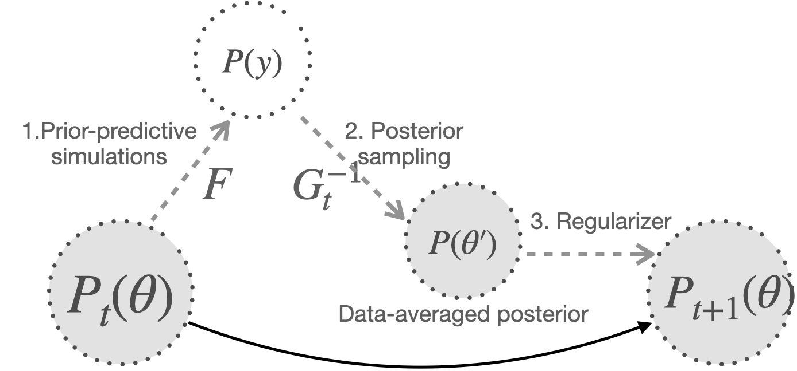

```{r setup, include=FALSE, warning=FALSE}
library(SBC)
library(cmdstanr)
library(parallel)
library(bayesplot)
library(posterior)
library(dplyr)
library(rstan)
library(future)
library(ggpubr)
library(rstanarm)
library(ggplot2)
options(mc.cores = parallel::detectCores())
plan(multisession)
options(SBC.min_chunk_size = 5)
set.seed(1984)
```

Definition:

- simulation prior := prior distribution that informs the prior predictive simulations and is being iteratively updated

- inference prior := prior distribution that informs the posterior distribution, and hence the posterior sampling method

- prior predictive distribution $P(y)$:= marginal distribution of $y, p(y)$ 

- data-averaged posterior $P(\theta')$:= combined posterior samples from each datasets

- posterior sampling method := a.k.a. inference algorithm in which distribution is the function of prior predictive distribution and inference prior

- default prior of chosen likelihood and posterior sampling method := wide enough prior to the level of not hurting self-consistency

-  SBC™: original SBC diagnose from Talts et. al. paper whose result we use for comparison before and after calibration purpose.

Prior predictive distribution is determined by two components, prior distribution and likelihood.
$$p(y_1,..,y_n) = \int \prod_{i=1}^{n} f(y_i|\theta)p(\theta)d\theta$$

Let us denote the distribution of likelihood and posterior sampling method as $F, G^{-1}$. Inverse is used to denote most posterior sampling methods reversely uses likelihood distribution to minimize the distance between the target and generated distribution. In SBC package, `glm` formula used for predictive distribution can be used as a approximation, what we call backend. See [implementing_backends](https://hyunjimoon.github.io/SBC/articles/implementing_backends.htmls) vignette for this.



Three steps are involved:
- 1. `generator`: generate parameter and outcome from prior $\pi_{\lambda_n}(\theta)$ and likelihood $f(y|\theta)$ 
- 2. `backend`: sample$\theta$ given prior, generated outcome, and posterior sampling methods
- 3. `self_calib`: update hyparameter $\lambda$ based on the difference between prior and data-averaged posterior 

In 2, for inference algorithms that returns point estimates on hyperparameter instead of parameter samples (e.g. laplace approximation or VI), we can change this to posterior sampling method by generating samples with $\hat{\lambda}$.

Proposition: Iteration of prior predictive simulation, posterior sampling, and regularizing converge to a default prior for a given prior distribution family, likelihood, and inference algorithm.

This is due to the recurrence of well-calibrated regions which will be illustrated in experiment 1 which shows different priors converging to the same distribution for simple Bernoulli likelihood and Laplace approximation as a inference algorithm. This approximation truncates Taylor expansion of the log target density at the mode to the sencond order i.e. $\mu_{t+1} = argmax \;f(w)$, $\sigma_{t+1} = -\frac{d^{2}}{d w^{2}} \log f(w) ; w=w_{0}$.

These are general settings for our experiment. One critical requirement for SBC™ is that the observational space has to match the observational space of interest. Not seeing diagnostic problems for posterior computation with `nobs`= 10 component observations doesn’t mean that the same computational method will also work for `nobs`= 100 component observations or vice versa.
```{R}
## Generator settings
# number of SBC simulations per iteration (generator)
nsims <- 10

# number of observations
nobs <- 2

# link function (1 = logit, 2 = probit, 3 = cloglog)
link <- 1

# number of binomial trials per observation
nsize <- 10

## Backend settings
# number of draws per posterior approximation 
ndraws <- 100

# number of chains for hmc posterior approximation
nchains <- 2
```

Received comments:
 - using random variable as X notation could help us learn the characteristic of operations $y = I(U \leq p(x)), U \sim Unif(0,1), p(x) = \frac{1}{1+ e^{-x}}$
 - $\mathcal{T} \pi = \pi$ is the equation we wish to solve where  $\mathcal{T} \pi:=\iint g(\theta \mid y, f, \pi) f\left(y \mid \theta^{\prime}\right) \pi\left(\theta^{\prime}\right) d y d \theta^{\prime}$. Parameterizing $\pi$, the goal changes to finding $\|\mathcal{T} \pi - \pi\| \leq \epsilon$ as it is hard to expect data-averaged posterior to be within parameterized family. For instance, data-averaged posterior from normal prior would not be normal in general. For brevity, $g_\lambda(\theta \mid y) := g(\theta \mid y, f, \pi_\lambda)$ and using a squared loss, then $\mathcal{T} \pi_{\lambda}=\iint g_{\lambda}(\theta \mid y) f\left(y \mid \theta^{\prime}\right) \pi_{\lambda}\left(\theta^{\prime}\right) d y d \theta^{\prime}$ and the self-calibration could be designed in the direction of $\frac{dZ_{\lambda}}{d\lambda}$ where $Z_{\lambda} := \int (\mathcal{T}\pi_{\lambda}(\theta) - \pi_\lambda(\theta))^2\pi^p(\theta)d\theta$. Note that calculating gradient is easier when the penalty weights are fixed which is why $\pi_p$ is used instead of $\pi_\lambda$. $pi^p$ is a penalizing prior on which calibration loss is averaged over in order to update lambda.
 
Then$\frac{dZ_{\lambda}}{d\lambda} = E[(\pi_\lambda(\theta))(\partial_\lambda\pi_{\lambda}(\theta))]$ where the expectation is  


```{R}
fit <- optimizing(model, data = dat, hessian = TRUE)
# approximate posterior mean via posterior mode
post_mean_eta <- fit$par["eta"]
# approximate posterior sd via (sqrt) of the inverse negative Hessian
post_sd_eta <- sqrt(solve(-fit$hessian))
```

# PASSIVE UPDATE
# TODO once SBC_backend supports rstan optimizing.
# Experient 1. 1.Normal simulation prior (samples: 100), 2.Bernouli-logit prior predictive simultation, 3. Laplace approximation posterior sampling (draws: 100) 4. mean and sd for DAP summary and use it for the next prior parameter

Target parameter is logit-transformed probability, $\eta$. Binomial likelihood and laplace approximation inference algorithm on logit scale is used. Hyperparameters for laplace approximation are $\mu, \sigma$ which correspond to posterior distribution mode and second derivative at the mode. These hyperparameter values are set as the prior parameter for the iteration. Results show starting from $N(0, 3^2)$ distribution, initial non-normal distribution slowly transforms to normal form to adjust to the constraints imposed by the approximation of inference algorithm, in this case normal distribution. Final convergence is around $N(0, 0.5^2)$.

Could we make this convergence to the well-calibrated prior more efficient, considering usecases with many calibration-target parameters?

# ACTIVE UPDATE
# TODO once SBC_backend supports rstan optimizing.
# Experient 2. 1.Normal simulation prior (samples: 100), 2.Bernouli-logit prior predictive simultation, 3. Laplace approximation posterior sampling (draws: 100) 4. coupling+gradient update based on moment-matching DAP summary (mean, sd)

# Experient 3. 1. Normal simulation prior (samples: 100), 2.Gamma-glm prior predictive simultation, 3. HMC posterior sampling (draws: 100) 4. coupling+gradient update based on moment-matching DAP summary (mean, sd)

```{r, warning=FALSE, error=FALSE}
# step1: 
generator_binom <- function(lambda_mu, lambda_sigma, fixed_sim_args){
  # fixed value across simulated datasets
  # experiment settings
  nobs <- fixed_sim_args$nobs
  link_type <- fixed_sim_args$link_type
  # clamped parameters

  # generate
  eta <- rnorm(1, mean = lambda_mu, sd=lambda_sigma)
  mu <- invtf_param_vec(eta, link_type = link_type)
  Y <- rbinom(nobs, size = nsize, prob = mu) 
  list(
    parameters = list(eta = eta),
    generated = list(nobs= nobs, 
                     lambda_mu = lambda_mu, lambda_log_sigma = log(lambda_sigma), 
                     Y = Y)
  )
}
fixed_sim_args_binom <- list(nobs = nobs, link_type = 1)
datasets_binom <- generate_datasets(SBC_generator_function(generator_binom, lambda_mu, lambda_sigma, fixed_sim_args_binom), n_datasets = nsims)


# step2: inferring posterior
rstan_mod <- stan_model("models/binom-laplace.stan")
cmdstan_mod <- cmdstanr::cmdstan_model("models/binom-laplace.stan")
rstan_backend_hmc <- SBC_backend_rstan_sample(rstan_mod, chains = nchains, iter = ndraws / nchains + 1000, warmup=1000)

backend_vi <- SBC_backend_cmdstan_variational(cmdstan_mod, output_samples = ndraws, algorithm = "fullrank")

# TODO
#backend_laplace <- SBC_backend_rstan_laplace(rstan_mod, iter_sampling = ndraws)
# backend_hmc <- SBC_backend_cmdstan_sample(cmdstan_mod, chains = 2, iter_sampling = ndraws / 2) if cmdstanr return hession
                
# initial badly calibrated
result_hmc <- compute_results(datasets, rstan_backend_hmc, thin_ranks = 1)
result_vi <- compute_results(datasets, backend_vi, thin_ranks = 1)
plot_rank_hist(result_hmc)
plot_rank_hist(result_vi)
```

```{R}
## Self-calib settings
# initial prior hyperparameters
lambda_mu <- 1
lambda_sigma <- 10

# hyperparameter update algorithm 
updator = "heuristic"

# maximal number of SBC iterations
niter <- 100

# tolerance
tol <- 0.02

# learning rate
gamma <- 0.5

# step3: updating hyperparmeters
param_sc_hmc <- self_calib_adaptive(generator_binom, rstan_backend_hmc, updator, "eta", lambda_mu, lambda_sigma, nsims, tol, fixed_args = list(fixed_sim_args = fixed_sim_args))
plot_rank_hist(param_sc_hmc)

param_sc_vi <- self_calib_adaptive(generator_binom, backend_vi, updator, "eta", lambda_mu, lambda_sigma, nsims, tol, fixed_args = list(fixed_sim_args = fixed_sim_args))
plot_rank_hist(param_sc_vi)
```

## 2. Computation
HMC is underdispersed. ADVI is skewed to the right and has a tendency to under-estimate.

```{r  warning=FALSE}
generator_gamma <- function(lambda_mu, lambda_sigma, fixed_args){
  # fixed value across simulated datasets
  ## meta
  nobs <- fixed_args$nobs
  K <- fixed_args$K
  shape <- fixed_args$shape
  # predictor
  X <- array(rnorm(nobs * K, mean = 1, sd = 1), dim = c(nobs, K))
  b <- rnorm(K, mean = 0, sd = 1)
  # generate
  eta <- rnorm(1, mean = lambda_mu, sd=lambda_sigma)
  logmu <- as.numeric(eta+ X %*% b)
  mu <- exp(logmu)
  Y <- rgamma(nobs, shape = shape, scale = mu/shape) 
  list(
    parameters = list(eta = eta),
    generated = list(nobs= nobs, K = K, X = X, shape = shape,
                          lambda_mu = lambda_mu, lambda_log_sigma = log(lambda_sigma), 
                          Y = Y)
  )
}

# prior hyperparameters
lambda_mu <- 2
lambda_sigma <- 5

fixed_args_gamma <- list(nobs = nobs, K = 15, shape = 1, nsims = nsims)
datasets_gamma <- generate_datasets(SBC_generator_function(generator_gamma, lambda_mu, lambda_sigma, fixed_args_gamma), n_datasets = nsims)

# step2: posterior sampling
mod_gr <- cmdstanr::cmdstan_model("models/gamma-reg.stan")
backend_hmc <- SBC_backend_cmdstan_sample(mod_gr, chains = 4, iter_sampling = ndraws / 4) # thin = 10
result_25_hmc <- compute_results(datasets_gamma, backend_hmc, thin_ranks = 1)
plot_rank_hist(result_25_hmc)
```

What happens with VI?
```{r setup, include=FALSE}
## Self-calib settings
# initial prior hyperparameters
lambda_mu <- 2
lambda_sigma <- 5

# hyperparameter update algorithm 
updator = "heuristic"

# maximal number of SBC iterations
niter <- 100

# tolerance
tol <- 0.02

# learning rate
gamma <- 0.5

# step3: updating hyperparmeters
# wrapper function to follow `self_calib_adaptive` interface
calib_generator <- function(lambda_mu, lambda_sigma, fixed_args){
  generate_datasets(SBC_generator_function(generator_gamma, lambda_mu, lambda_sigma, fixed_args), n_datasets = fixed_args$nsims)
}
param_sc_hmc <- self_calib_adaptive(calib_generator, backend_hmc, updator, "eta", lambda_mu, lambda_sigma, nsims, tol, fixed_args = list(fixed_args = fixed_args))
plot_rank_hist(param_sc_hmc)

backend_vi <- SBC_backend_cmdstan_variational(mod_gr, output_samples = ndraws, algorithm = "fullrank")

result_25_vi <- compute_results(datasets_gamma, backend_vi, thin_ranks = 1)
plot_rank_hist(result_25_vi)
param_sc_vi <- self_calib_adaptive(generator_gamma, cmdstan_backend_vi, "eta", lambda_mu, lambda_sigma, nsims, tol, fixed_args = list(fixed_args = fixed_args))
plot_rank_hist(param_sc_vi)


library(SBC) #devtools::install_github("hyunjimoon/SBC")
library(cmdstanr)
library(parallel)
library(bayesplot)
library(posterior)
library(dplyr)
library(future)
library(ggpubr)
library(mclust)
library(rstanarm)
options(mc.cores = parallel::detectCores())
plan(multisession)
options(SBC.min_chunk_size = 5)
set.seed(1984)
devtools::load_all()
```

```{r echo=FALSE, message=FALSE, warning=FALSE}
knitr::opts_chunk$set(
  include = TRUE,  cache = FALSE,  collapse = TRUE,  echo = TRUE,
  message = FALSE, tidy = FALSE,  warning = FALSE,   comment = "  ",
  dev = "png", dev.args = list(bg = '#FFFFF8'), dpi = 300,
  fig.align = "center",  fig.width = 7,  fig.asp = 0.618,  fig.show = "hold",
  out.width = "90%")
```

```{r}
#_poisson, _logistic with transform_type  = "log", / family 
generator_gmm <- function(mixture_means, mixture_sds, fixed_sim_args){
  # fixed value across simulated datasets
  ## meta
  nobs <- fixed_sim_args$nobs
  ndraws <- fixed_sim_args$ndraws
  transform_types <- fixed_sim_args$transform_types
  link_type <- fixed_sim_args$link_type
  ## distribution-specific
  shape <- fixed_sim_args$shape 
  
  # predictor
  if("X" %in% names(fixed_sim_args)) {X = fixed_sim_args$X} else X = 0
  # parameter with fixed distribution across `nsims` datasets
  if("b" %in% names(fixed_sim_args)) {b <- fixed_sim_args$b}  else b = 0
  # target variable updated at each iteration
  a <- invtf_param_vec(rvar_rng(rnorm, n = 1, mean = sample(mixture_means$a, nsims, replace=TRUE), sd=mixture_sds$a, ndraws = nsims), tf = transform_types$a)

  # generate
  mu = draws_of(a + X %**% b)
  if(link_type == "log"){
        mu =  exp(mu) 
  }else if(link_type == "logit"){
        mu <- invlogit(mu)
  }
  Y <- rvar_rng(rbinom, n = nobs, size = nsize, prob = mu, ndraws = nsims) 
  if(any(is.na(Y))) print(mu) 
  gen_rvars <- draws_rvars(nsims = nsims, nobs = nobs, nsize = nsize,
                           mixture_means = mixture_means$a, mixture_sds = mixture_sds$a, 
                           Y = Y)
  SBC_datasets(
    parameters = as_draws_matrix(list(a = a)), 
    generated = draws_rvars_to_standata(gen_rvars)
  )
}
nsims = 30
nobs = 100
ndraws = 1000
nsize = 2
npredictors = 15
ntarget_params = 1
chains = 4
transform_types = list(a = "identity") # parameter constraint in stan translated to generator (e.g. bound, simplex)
fixed_sim_args <- list(nobs = nobs, ndraws = ndraws, nsize = nsize, link_type = "logit", transform_types = transform_types, shape = 1,  b = rvar_rng(rnorm, ndraws = 1, n = npredictors, 0, 1), X = rvar(array(rnorm(n = nobs * npredictors, mean = 1, sd = 1), dim = c(1, nobs, npredictors))))

# proxy for target variable
mixture_means = draws_rvars(a = rvar(array(rep(rnorm(nsims, 2, 5), each = nsims), dim = c(nsims, nsims))))
mixture_sds = draws_rvars(a = rvar(array(rep(1, nsims), dim=c(nsims, 1))))

datasets_25 <- generator_gmm(
  mixture_means = mixture_means,
  mixture_sds = mixture_sds,
  fixed_sim_args = fixed_sim_args
)

#mod_gmm <- cmdstanr::cmdstan_model("./models/gamma-reg_gmm.stan")
mod_gmm <- cmdstanr::cmdstan_model("./models/binom-laplace_gmm.stan")
backend_hmc_gmm <- SBC_backend_cmdstan_sample(mod_gmm, chains = chains, iter_sampling = ndraws / chains)
```

Starting from a bad SBC plot (first), better SBC plot (second) is found after three iterations.
```{r}
result_25_hmc <- compute_results(datasets_25, backend_hmc_gmm, thin_ranks = 3)
plot_rank_hist(result_25_hmc)

# self-calibrate
param_sc_hmc <- self_calib(generator_gmm, backend_hmc_gmm, mixture_means, mixture_sds, nsims_fn = function(...){nsims}, thin = 3, transform_types = transform_types, fixed_generator_args = list(fixed_sim_args = fixed_sim_args))
plot_rank_hist(param_sc_hmc)
```

For ADVI, $N(2,5^2)$ for the coefficient breaks in every case and therefore $N(2,1^2)$ is used. Notice as the self-consistent parameter region is a function of a generator and inference engine; prior $N(2,5^2)$ or $N(2,1^2)$ is simply used as an initial distribution. It remains to be seen whether different initial distribution converge to near enough region (near uniqueness). 

```{r}
mixture_means_21 = draws_rvars(a = rvar(array(rep(rnorm(nsims, 2, 1), each = nsims), dim = c(nsims, nsims))))
datasets_21 <- generator_gmm(
  mixture_means = mixture_means_21,
  mixture_sds = mixture_sds,
  fixed_values = fixed_values
)

backend_vi <- SBC_backend_cmdstan_variational(mod_gmm, output_samples = ndraws, algorithm = "fullrank")
result_21_vi <- compute_results(datasets_21, backend_vi, thin_ranks = 1)
plot_rank_hist(result_21_vi)

# self-calibrate
param_sc_vi <- self_calib(generator_gmm, backend_vi, mixture_means_21, mixture_sds, nsims_fn = function(...){nsims}, thin = 1, fixed_generator_args = list(fixed_values = fixed_values, ))
plot_rank_hist(param_sc_vi)
```

```{r}
plot_ecdf_diff(param_sc_vi)
plot_ecdf_diff(result_21_vi)
```
